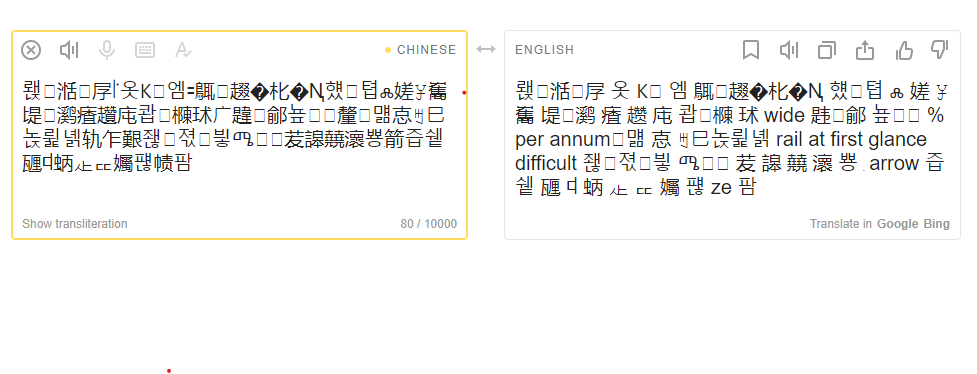
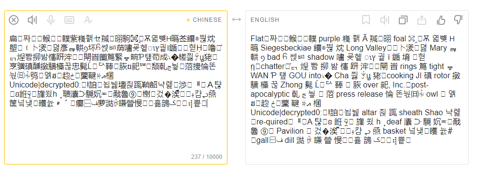
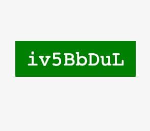
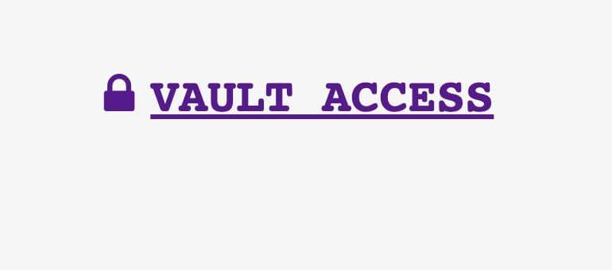
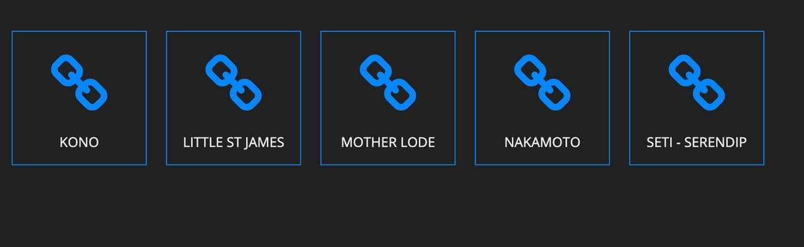
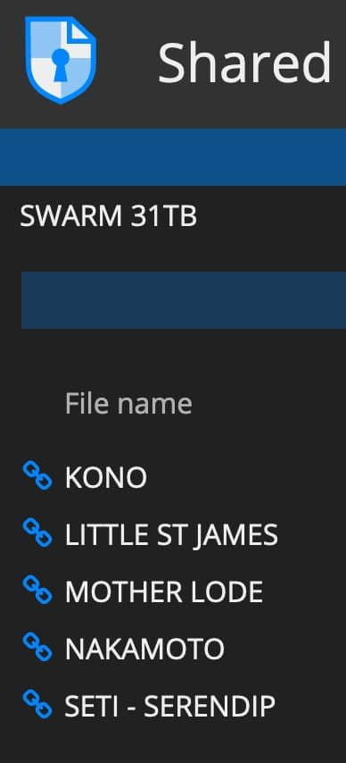
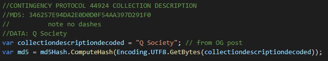

# notes

cant tell if these are just examples of how to decode something or an exercise in futility, or the output generator that produces a code to unlock 31TB worth of data, or 100% time sinc/sync?

the original epsilon and omega strings are from the original post examples

## Conversions

converting some text encodings - ASCII / Unicode etc
## Epsilon - decoded base64 byte[] to Ascii

while debugging it looked like a unicode string

> ??C?In???7?7?????????L???G??<g6???????y?>,?Z/???-5?=?????^????j?>4/??u?????,????&?`???.}?I?e?h?MNq???\;???C?N?	??G?6$p????{??i?u|???????N[f?;^?
### same byte[] to Unicode

> 뢙湉㞌꜎옷Ꮶꚿ엠꞊䳖䞵�朼�Ꞑ헀텹ⰾ嫅ꐯ雟㔭᜛㶉㾴趲庉쾁樄㺷⼴韙鄃눂釐먦怘ꒄ⺒녽륉녥轨乍艱좮౜젻빃ሜᰉ苃䜂㚁瀤뿅࣭箭즙쉩甅ꕼ蛃龰ퟍ孎퍦帻팜

### actual translation??, odd nonetheless:



result:

> 뢙湉㞌 옷 Ꮶꚿ 엠 䳖䞵�朼�Ꞑ 헀텹 ⰾ 嫅 ꐯ 雟 㔭᜛㶉 㾴 趱 庉 쾁樄 㺷 wide 韪鄃 눂 % per annum먦 怘 ꒄ⺒녽륉녥 rail at first glance difficult 좮౜젻빃 ሜᰉ 苃 䜂 㚁 瀤 뿅 ࣭ arrow 즙쉩 甅 ꕼ 蛃 龰 ퟍ 孎 퍦 ze 팜

`wide` 

`per annum` 

`rail at first glance difficult` 

`.arrow` 

This is really weird

## Omega - decoded base64 byte[] to Ascii

again... Ascii:

> Ab'???2??!????*+P?+}?]???0????C??H2?X?j??:?|;??_??%???=qX??[?/un	???e_???,OW????t1k??5f???d?????N?	X$???4??V????=m??9??9??vm??X????\WFB?}?yu?.???b??s??i???????rn??p???????d?K<???_??9?b?lJ?"A !???yNw?;?9???\c?`?#?02l?.????.Ey??C?????#???h

### so... same byte[] to Unicode

using the same input byte array to Unicode:

> 扁짜⇙鯸⬪轐紫嶘쫽セ羬䎅駒㉈ިѪ엷뼺ᕼ㬙莶饟◎뚾㶩塱﹛⼘湵뎛彥ᇕ輁ⳋ坏꧵쎉ㅴ荫㗲굦헽ၤץ궡ï鍎堉︤혇ῌ嚕໬֡ᇊ㷐뽭㧕밞㦥趼浶閛峕圏䉆緊ᇴ畹Ƥ턮苟成꧈�槎쯿ꂕꚏ狫烹骥磌醺撴䮲㰛꾾忠髨Ĺꥢ䩬ᤝ脄ย䄐℠颓乹ﭷ눻ﴹ菬捜惀똔눣㈰ꑬ鸮ᯂ엙ฮ౅赹ځ藳鞬ꄣއ棞
Unicode|decrypted0:!詯뇝뉋壇쵡踂鞘韶냑롍渉ᅤ஫Ａ탾ꭧꞛ銋፶ᨻ㫎쑀һ⢀聩灢ᑠ䮭㚮≖㦷魯⑨ࠩ榭ﲣ겄�涘ⷿᬲ࿈캼ᖢ焏筐넠냋矆늀﹟゛癭⿱ف萝㵈ꋱ䁠䁝㥗⯡횲䳝ک꬚⢾쁱᣻

cap after the translattion - more odd


> Flat짜⇙鯸⬪轐 purple 嶘 쫽 Ã 羬䎅 foal ㉈ި Ѫ 엷뼺 ᕼ 㬙 Siegesbeckiae 饟◎뚾 㶩 Long Valley﹛⼘湵뎛 Mary ᇕ 輁 ⳋ bad ꧵ 쎉ㅴ shadow 㗲 굦헽 ၤץ 궡 ï 鍎 堉 ︤혇 ῃchatter໬֡ᇊ 㷐 뽭 㧕 밞 㦥 趼 浶閛 峕 rings 䉆 tight ᇴ WAN Ƥ 턮 GOU into꧈� Cha 쯿 ꂕꚏ 狫cooking JI 磌 rotor 撴 䮲 㰛 꾾 Zhong 髨 Ĺꥢ 䩬 ᤝ 脄 over 䄐, Inc.post-apocalyptic 乹 ﭷ 눻 ﴹ 菬 press release 惀 똔눣㈰ꑬ owl ᯂ 엙 ฮ౅赹 ځ藳 鞬 ꄣއ 棞
Unicode|decrypted0:!詯뇝뉋 altar 쵡 踂 sheath Shao 냑롍re-quiredᅤ஫A 탾ꭧꞛ 銋 ፶ᨻ 㫎 쑀 һ⢀deaf 灢 ᑠ 䮭 㚮≖㦷 魯 ⑨ࠩ Pavilion ﲣ 겄�涘 ⷿᬲ࿈캼 ᖢ 焏 basket 넠냋矆 늀﹟gall⿱ف dill 㵈 ꋱ 䁠 䁝 㥗⯡횲 䳝 ک꬚⢾쁱᣻

you can read ^^^ - same thing as above etc... no clue beyond this

## interesting though

`Unicode|decrypted0:`

`press relese`

`apocalyptic`

---
## Update August 29, 2021

Some more text posted since last looking at this:

```
Did You Miss Me —-?

I Have Released 4 Laptops to the Media
Prepare for Part2
98 Hours
The Storm is Here.

I Am Protected by the Best — Team McAfee
We Will Always Live Forever.
I Have the Best Team — 
McAfee Intel
We Are the Best White Hat Hackers in 
The World.
WWG1VVGA.

P@IN 
DELIVERED
N.C.S.W.I.C


John McAfee.
```

next was this - and it's currently the **pinned post**

```
HOWLING: 
1106 812 814 
1005 807 
1111:

VVITHKIDS\JARRET.HALEKOA.
TREASON.CQCAINE.CIVI&GOV.
]SURVEILANCE.[UNMASKED].[
FOLLOWYc"FAMILY"MPS[BIDEN]\41\HILLDAWG
11.3:3.11 
11.4 11.5
\LETSBFRANK\CHENEY\NONAME[OBLA,MA\NONAME\"DIGNITY"\
EVERYDOGHASHISDAY\DOGDAYS\
H.OTSUMMER]REMOVED[DELIVER DOA 4 DIRECT BODY\
IRIS CONFIRM]]CONFIRMED]]]jan 13[

KNEVV BIN LADENS [EXACT][LOCATION]08\09]
Lupe Fiasco BUILDING[7]DID THEY REALLY PULL IT. . .?
JAMES FRANCIS RYAN JIM RYAN 
[CLOCK]SEATLLE RAINIER 
[SQUARE]VVORLDTRADEC
]FOUND[]LQCATION]

B8IRD DOWN IN CITY SUPER61 
BLACK/HAVVK/DQWN/T1
[E],MERGEN ]C[ PENTAGON 
CALL SAERENA DEL SOL
WATCJH COSASTS R
TESTIFY THEN DRO[P
BODIRS DARK/\/ESS 2 LITE

Operation Valkyrie[1914]<[1913]<8<WW2 
COUP[ON]>[SEA][EYE][YAY]>CCCP>8888
[Q]PERATION][VV]ALKYRIE] IS IN 
]EFFECT[

[CUT>THE>CREDITS]PER[45]:
MY FELLOW ]ANONS[. ONE YEAR FROM 2DAY 
REF RTROUPLOAD ]]]11.3.2020[[[. JOIN MI. BULLETPROOF.S5
[VVE]WILL TAKE BQCK WHAT IS[MINE]
]OURS[
]PRE11.3[ MRKSNW WE R 17 The Great Speech [Charlie][Time]Hans Zimmer INCEPTION Them:
112263 10/26/2021 [V]ignettes of Early Radiation VVORKERS 
1978 369 963[11]/[5]/2-21

4 CHAN REFUGEE HAM]RADIO[
LONG LIVE SACRED GERMANY
%5D&
LADIESMAN217
HE
WILL NOT DIVIDE
US
CTF aeiii
EYES on c17s salute to service game 
Centurylink-0lumen]RE READ ALL ]DRQPS[
CHRON CYCLICAL NON LINEAR 
EYE HEAR ]YOU[
UNUSUAL REQUEST
]UK[ ]AUS[ ]MI[ [POWERADENZ] ]REDCASTLE:GREN[ ]FIVE;EYES[
MIRROR QUADRIT 
ANALOG SOURCE CODE
EMERGENCY SEND THROUGH
LQQK TO THE SKY
WE'RE NOT DUNN
VVE NEVER LEFT EITHER. . .

N.C.S.W.I.C


John McAfee.
```

"*Something Terribly Big Is Coming*"

```
Something Terribly Big Is Coming
All the Right People are Scared
Shitless. . .

All the Right People Hold the Key
The Videos. . .
Remember
Just Because You Can't See It 
Doesn't Mean Big things Aren't
Happening
It Had To Be This Way. . .

Did they get the shot?
I pointed directly at it 3x
I turned and double pointed just to be clear. . .
Everything Has Meaning Patriots.

Mr. Kabala Harris
The First illegitimate TRANS Vice President
What an Honor
You Are Next. . .

What Do Hunted Biden and Mr. Kabala
Have in Common. . . ?
Remember
Wait for the Uploads.

N.C.S.W.I.C
[N][O][T][H][I][N][G]


John McAfee.
```

There were a few countdown clock images, then

```
Patriots —In the name of Democracy, let us all Unite!
Look up! Look up! The clouds are lifting 
The Sun is breaking through. 
We are coming out of darkness into the light. 
We are coming into a New World 
– a kind new World where men will rise above their hate and Brutality.
The soul of man has been given wings
At Last he is beginning to Fly. 
He is flying into the rainbow, into the light of hope, 
Into the Future, that glorious Future that belongs to you 
To Me and to All of Us. 
Look up Look up!

N.C.S.W.I.C


John McAfee.
```

> Then a public pgp key was posted

[PGP Public Key](pubkey.txt) (in pubkey.txt)

## latest images from today

haven't looked at EXIF if there is any yet...


could be relavent:



vault access?



folders...


&



vertical...




```
All Assets have been Deployed:

I've collected files on corruption in governments, politicians, fake news, “celebrities” and More. . . 
For the first time, I'm naming Names and Specifics:
 
I have Unlocked the Vault to the deadliest switch you can imagine 31+ terabytes of the most incriminating data will be released to the Public WorldWide. . .

All Keys have been provided in my Channel:
It is up to You to Look for the Truth:

What happens when people 
learn the TRUTH?
What happens when people WAKE UP?
What happens when We The People 
Have had Enough!!??
Conspiracy No More

If You thought Yesterday 
Was Bad Just wait
They will not be able to walk 
down the street. . .

Do You hear that?
The Calm Before the Storm:
Have Faith in Humanity
Have Faith in Yourself
Never Give Up
Who Wins in the End. . .?
WWG1VVGA

N.C.S.VV.I.C
```

(won't be posting the pics for obvious reasons)

```
Hey Killary Clinton
Remember Me. . .?
I’m Coming back to 
Haunt You like You
Did to Me:
I Will Have the 
Last Laugh this
Time. . .

Tic Tok

N.C.S.W.I.C

John McAfee.
```

## >>> soooooo....

Handful of posts since looking at this last

Moar rando notes:

* **Here's the text from the Green / white picture:**

> `iv5BbDul`

*starts with "iv"... (**i**)nitialization (**v**)ector? - it's probably not important, but worth noting*

the first Initialization Vector from the original posts was:



> `346257E94DA2E0D0D0F54AA397D291F0` is the MD5 hash of "**Q Society**"

> `8814D05348FFD43756D1F5BA745EDAE4` is the MD5 of "**iv5BbDul**" - the text from the green/white picture

## *side note: aren't some of the image files from 17's posts just strings of letters/numbers? could be worth trying*

Output of the `testkey2` with the `iv` set to the text of the green/white picture

> 䐵⺻抬ڀ䠦澉狨娉乣ᙌꌃ≁췡መ瞾錙瀹㕀鍝섿劓谝蒐註范牕켒ᷤ귒ə㉗㈺믋벮杵ℱ㿳끻ᜂ觯玱࠭Ꙉ괣ᇑ죘⥗쟛౛蠉카㔮겉ꖺṋ婧ܾ낦늿뗬㤔蜌㨝뒮魯愳ᕬ䋮鿲侰춁醔餓嬫

with a random Chyna -> Engrish translator online

> 䐵⺻lift ڀ 䠦 Gan marmoset pin 乣 ᙌꌃ≁췡 መ other Zi a 㕀 鍝 섿 劓 boaster semi-note Van 牕 켒 ᷤ귒 ə㉗㈺믋벮 pestle ℱ 㿳 끻 ᜂGoblet 玱 ࠭Ꙉ 괣ᇑ죘⥗쟛౛you카 㔮 겉 ꖺṋ Jing ܾ낦늿뗬 㤔蜌 㨝 뒮 Lu 愳 ᕬ 䋮鿲侰 춁 醔 hungry 嬫

interesting....

using `testkey1`... 

>ʶ쐾杁꽼ࢳ넰ưꎪԾ憿ɰ᳈٥陲ঐẫ즰�如 뒌사ﻅ꿱龤֟踋㇧＋ﮑ䚚﬈臘䆬橭໺货㽩ꮞ趇䩟㌁ꜗ㣛餲ꠥ㓪ფ糜⇋ʚᢕ銱케뎮 联"튐좢䋠脲멅�簥�궶ニꈗ䭓憎눱睜㱂担༸

Translated Online:
> ʶ 쐾 杁 꽼 ࢳ 넰ưꎪԾ 憿 ɰ᳈٥ TKC ঐẫ 즰�as 뒌사 ﻅ 꿱 龤 ֟ 踋㇧＋ﮑ 䚚﬈wax 䆬 橭໺goods 㽩 ꮞ趇 䩟㌁ꜗ 㣛 餲 ꠥ 㓪 ფ Mi⇋ʚᢕ Diao 케뎮 With"튐좢 䋠urea 멅�簥�궶Ni ꈗ 䭓 hydrophobic 눱 keep 㱂 supported༸

`Gan marmoset pin`

`other Zi a`

`boaster semi-note Van`

`pestle`

`Goblet`

`you`

`Jing`

`Lu`

`hungry`

**okthen_wtf.jpg**...

# TODO: try more cobinations?

OG Data:

* Three "test keys"
* One Initialization Vector that was "Q Society"
* Two strings:
  * epsilon
  * omega

## Cool Strings:

A couple accounts on twatter came up with the Initial / Outer archive password. May as well keep a list, in [cool_strings.txt](cool_strings.txt).
